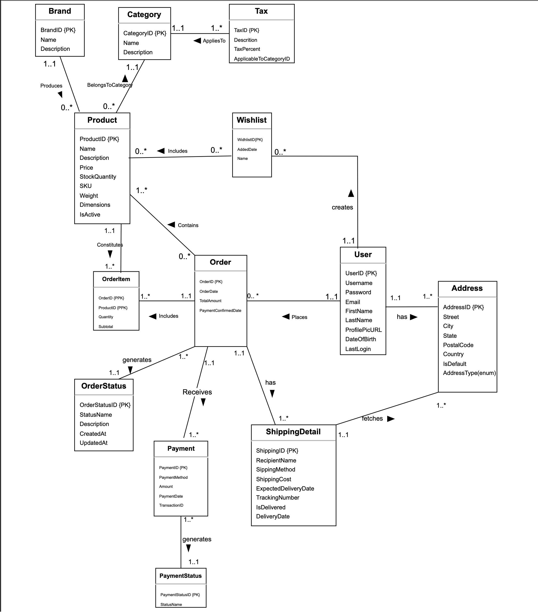
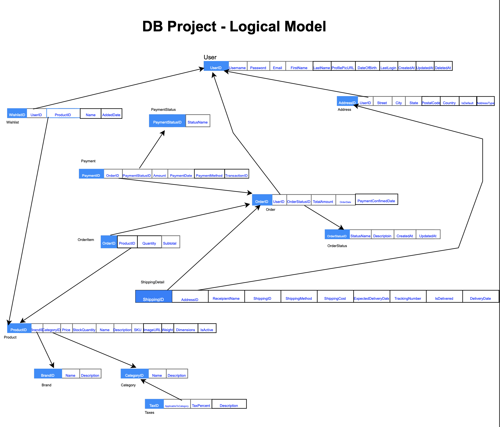

# E-commerce Website Database Project
## Course: IDATG2204 - Spring 2024

### Project Introduction

Welcome to our semester project for the IDATG2204 e-commerce website course, focusing on developing a database for an e-commerce platform. This README outlines the steps and methodologies used from the initial design to the final implementation. Key technologies include MySQL for database management, Python for backend development, and Flask as the web framework. If you encounter any issues, especially with setup, refer to the [third meeting](#third-meeting-april-24-2024) for detailed instructions.

### Team Composition

**Active Members:**
- Pau Sawm Tung
- Phrot Vedal
- Tiago Brito

**Note:** Initially, our team consisted of five members. However, due to unforeseen circumstances, we were unable to establish contact with two members as the project commenced.

### Meetings and Progress

### Initial Meeting (April 11, 2024)
**Objective:** Understand the project scope and begin the database design process.

**Key Activities:**
- **Project Requirements Review:** Detailed discussion of the project requirements to align team understanding and objectives.
- **Database Design and EER Modeling:**
  - Collaborative identification and definition of entities and attributes.
  - Utilization of Draw.io to develop an Entity-Relationship Diagram (ERD) that visually represents entity relationships. 

### **Defined Entities and Attribute Definitions:**
This section provides detailed descriptions of each entity and their respective attributes in the database. This documentation helps in understanding the data model and structure of the database.

### Product
- **ProductID**: Unique identifier for the product.
- **Name**: Name of the product.
- **Description**: Detailed description of the product.
- **Price**: Price of the product.
- **Stock Quantity**: Number of units in stock.
- **BrandID**: Identifier for the brand associated with the product.
- **CategoryID**: Identifier for the category of the product.
- **Image URL**: URL to the product image.
- **SKU**: Stock Keeping Unit, unique identifier for each product.
- **Weight**: Weight of the product.
- **Dimensions**: Dimensions of the product.
- **IsActive**: Indicates whether the product is active for sale.

### Category
- **CategoryID**: Unique identifier for the category.
- **Name**: Name of the category.
- **Description**: Detailed description of the category.

### Tax
- **TaxID**: Uniquely identifies each tax entry.
- **Description**: A textual description of the tax, including information on what the tax is for and how it is calculated.
- **TaxPercent**: Represents the tax rate as a percentage that will be applied to the product's price.
- **ApplicableToCategoryID**: Identifies the product category to which the tax applies.

### Brand
- **BrandID**: Unique identifier for the brand.
- **Name**: Name of the brand.
- **Description**: Detailed description of the brand.

### User
- **UserID**: Unique identifier for the user.
- **Username**: Username of the user.
- **Password**: Password for user authentication.
- **Email**: Email address of the user.
- **FirstName**: First name of the user.
- **LastName**: Last name of the user.
- **Profile Pic URL**: URL to the user's profile picture.
- **Date of Birth**: User's date of birth.
- **Last Login**: Timestamp of the last login.

### Address
- **AddressID**: Unique identifier for the address.
- **UserID**: Identifier linking the address to a user.
- **Street**: Street part of the address.
- **City**: City part of the address.
- **State**: State part of the address.
- **Postal Code**: Postal code part of the address.
- **Country**: Country part of the address.
- **Is Default**: Indicates if it is the default address for the user.
- **Address Type**: Type of address (e.g., billing, shipping).

### Order
- **OrderID**: Unique identifier for the order.
- **UserID**: Identifier for the user who placed the order.
- **Order Date**: Date when the order was placed.
- **Total Amount**: Total amount of the order.
- **Order Status ID**: Identifier linking to the status of the order.
- **Payment Confirmed Date**: Date when the payment was confirmed.

### Order Status
- **Order Status ID**: Unique identifier for the order status.
- **Status Name**: Name of the status.
- **Description**: Description of what the status represents.
- **Created At**: Creation date of the status.
- **Updated At**: Last update date of the status.

### Order Item
- **OrderID**: Identifier linking the item to an order.
- **ProductID**: Identifier for the product ordered.
- **Quantity**: Quantity of the product ordered.
- **Subtotal**: Subtotal price for the quantity ordered.

### Payment
- **PaymentID**: Unique identifier for the payment.
- **OrderID**: Identifier linking the payment to an order.
- **Payment Method**: Method used for payment (e.g., credit card, PayPal).
- **Amount**: Amount paid.
- **Payment Date**: Date when the payment was made.
- **Payment Status ID**: Identifier linking to the status of the payment.
- **Transaction ID**: Identifier for the transaction.

### Payment Status
- **Payment Status ID**: Unique identifier for the payment status.
- **Status Name**: Name of the payment status.

### Shipping Detail
- **ShippingID**: Unique identifier for the shipping detail.
- **OrderID**: Identifier linking the shipping to an order.
- **Recipient Name**: Name of the person who will receive the order.
- **AddressID**: Identifier for the delivery address.
- **Shipping Method**: Method of shipping used.
- **Shipping Cost**: Cost of shipping.
- **Expected Delivery Date**: Expected date of delivery.
- **Tracking Number**: Tracking number for the shipment.
- **Is Delivered**: Indicates if the order has been delivered.
- **Delivery Date**: Actual date of delivery.
- **Base Cost**: Base cost of shipping.
- **Weight Surcharge**: Additional cost based on weight.

### Wishlist
- **WishlistID**: Unique identifier for the wishlist.
- **UserID**: Identifier linking the wishlist to a user.
- **ProductID**: Identifier for the product in the wishlist.
- **Added Date**: Date when the product was added to the wishlist.
- **Name**: Name of the wishlist.

### Database Entity Relationships Overview
This section outlines the relationships between different entities in the database. Understanding these relationships is crucial for navigating and managing the database effectively.

### User and Order
- **Relationship**: One-to-Many
- **Description**: A user can place zero or several orders, and each order is associated with only one user.

### User and Address
- **Relationship**: One-to-Many
- **Description**: A user can have multiple addresses (such as billing and shipping addresses).

### User and Wishlist
- **Relationship**: One-to-Many
- **Description**: A user can have zero or multiple wishlists.

### Wishlist and Product
- **Relationship**: Many-to-Many
- **Description**: A wishlist can contain multiple products, and a product can appear in multiple wishlists.

### Order and OrderItem
- **Relationship**: One-to-Many
- **Description**: An order can contain multiple items, but each order item references only one order.

### Order and Payment
- **Relationship**: One-to-Many
- **Description**: An order can have multiple payments (in cases of partial payments).

### Order and Shipping Detail
- **Relationship**: One-to-Many
- **Description**: An order can have one or more shipping details, especially if items are shipped separately.

### OrderItem and Product
- **Relationship**: Many-to-One
- **Description**: Each order item is associated with one product.

### Product and Brand
- **Relationship**: Many-to-One
- **Description**: Each product is associated with one brand.

### Product and Category
- **Relationship**: Many-to-One
- **Description**: Each product is associated with one category.

### Category and Tax
- **Relationship**: One-to-Many
- **Description**: Each category can have multiple tax rates applied, but each tax entry is associated with one specific category. This allows for the application of different tax rates to different categories of products, essential for compliance with varying tax laws and regulations across regions.

### Order Status and Order
- **Relationship**: One-to-Many
- **Description**: Each order has one current status, but the status can apply to many orders.

### Payment Status and Payment
- **Relationship**: One-to-Many
- **Description**: Each payment has one current status, but the status can apply to many payments.

### Address and Shipping Detail
- **Relationship**: Many-to-One
- **Description**: Each shipping detail refers to one address for delivery.

A high level description of logical model: 

### Second Meeting (April 14, 2024)
**Objective:** Refine the EER model, begin normalization, and create SQL scripts.

**Activities:**
- **Database Normalization:** Application of normalization principles (1NF, 2NF, 3NF, BCNF).Each tables are availabe here: `table.table`

- **SQL Script Development:** Creation of SQL scripts for table definitions, constraints, and initial data population. Scripts are available in 
- **Database Testing:** Population of the database with sample data and testing using phpMyAdmin

### Third Meeting (April 24, 2024)
**Objective:** Test the application on different machines to ensure smooth operation across various setups, specifically focusing on MySQL database connectivity issues encountered when running the application from the cloned GitLab repository.

**Key Activities:**
- **Application Testing on Various Machines:** Identified issues with MySQL database connections when running the application locally. The team tested running the application by cloning the GitLab repo and executing `main.py`.

- **Configuration Fixes and Setup Instructions:**
  - **Installing Python and Dependencies:**
    - **Python Installation:** Recommended installation through VSCode, which prompts for Python installation if not already installed.
    - **Flask Installation:** Used `pip install Flask` and verified installation with `flask --version`.
    - **MySQL Connector Installation:** Used `pip install mysql-connector-python`.

  - **MySQL Database Setup and Connection:**
    - **Check MySQL Service:** Ensure that MySQL is running on your machine (installation method varies, e.g., `brew install mysql` for macOS).
    - **Navigate to SQL File Directory:** `cd /Users/tungno/Desktop/database_project/db`.
    - **Log in to MySQL:** `mysql -u root -p`.
    - **Create New Database:** `CREATE DATABASE electromart_databaseproject;`.
    - **Exit MySQL Command Line:** `EXIT;`.
    - **Import SQL File:** `mysql -u root -p electromart_databaseproject < electromart_databaseproject.sql`.
    - **Verify the Import:** Check for the presence of tables and data using `USE electromart_databaseproject; SHOW TABLES;`.
    - **Connecting and Updating SQL File:** `mysqldump -u root -p electromart_databaseproject > electromart_databaseproject_updated.sql`.

**Next Meeting Scheduled:** April 26, 2024, with the agenda to discuss frontend development strategies and progress.

### Fourth Meeting (April 26, 2024)
**Objective:** Reflect on past activities, including database setup and normalization, and align on future tasks, especially regarding frontend development.

#### Key Activities:

- **Discussion of Previous Work:**
  - **MySQL Setup:** Review and address any remaining challenges related to MySQL environment setup.
  - **Normalization Stages:** Reflect on the applied normalization principles (1NF, 2NF, 3NF, BCNF), ensuring that the current schema aligns with best practices.
  - **EER Model Review:** Acknowledge that while the current EER model is robust, there's room for improvement. The team decides to revisit and revise the model if time permits, noting that the project's primary evaluation will focus on the database modeling.

- **Frontend Development Strategy:**
  - **Frontend and Backend Integration:** Tiago Brito assumes the lead role in ensuring a seamless frontend that effectively interacts with the backend infrastructure already developed.
  - **User Experience:** Emphasis on crafting a user-friendly interface that adheres to modern design principles, aiming for a smooth and intuitive user experience.

#### Next Meeting:
Scheduled for May 03, 2024, to evaluate frontend progress and finalize the database model.

### Backend Development Planning

**Technology:** Python with the Flask framework has been chosen for backend development. Frontend development will utilize HTML, CSS, and JavaScript to ensure a dynamic and responsive user interface.

**Responsibility Distribution:**
- **Pau Sawm Tung:** Responsible for overall backend development, focusing on integrating and managing the database interactions for entities such as Product, Category, Tax, Brand, User, and Address.
- **Tiago Brito:** Takes the lead on frontend development, ensuring that the user interface is effectively integrated with the backend services, using HTML, CSS, and JavaScript to craft a seamless user experience.
- **Phrot Vedal:** Focuses on the database normalization process, responsible for drafting sample tables at each normalization stage to ensure data integrity and efficiency.

### Documentation and Normalization
- **Database Modelling:** The entire team collaborates on developing and refining the database model, focusing on aligning it with both the backend functionalities and frontend requirements.
- **Project Documentation:** Pau Sawm Tung continues to document the development process and maintain progress updates, ensuring that all aspects of the backend development are well-documented.

### Contributing
If you are interested in contributing to this project or have suggestions for improvements, please follow our contribution guidelines outlined here or submit issues directly through GitLab.

### Troubleshooting
For common setup issues and their solutions, refer to the troubleshooting guide in this section to help resolve common problems that might arise during the installation and setup process.

### Contact Information
For more information or inquiries, please contact:
- Pau Sawm Tung (paut@ntnu.no)
- Phrot Vedal (phrot.vedal@ntnu.no)
- Tiago Ceolho Brito (tiago.c.brito@ntnu.no)